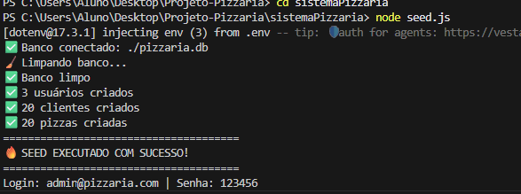
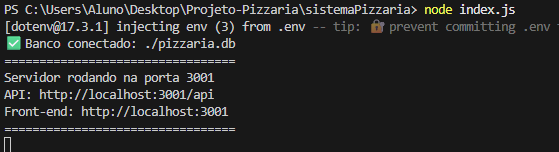
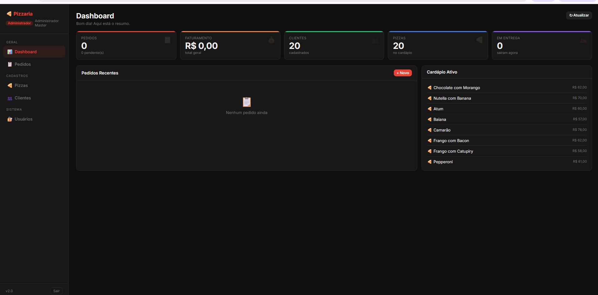

# 🍕 Sistema Pizzaria

## 👩‍💻 Integrantes

* Fernanda C. Rodrigues Ferreira
* Isabelle Queiroz Rodrigues

---

## 📌 Sobre o Projeto

Este projeto consiste em uma API de sistema de pizzaria, desenvolvida com o objetivo de simular um cenário real de desenvolvimento, onde o **front-end** e o **back-end** funcionam separadamente/ou no mesmo computador e se comunicam por meio de requisições.

A proposta inicial foi fornecida pelo professor, e o principal desafio era **organizar, corrigir e estruturar o código** de forma funcional, limpa e eficiente.

---
**BANCO CONECTADO**




**API RODANDO**




**PAGINA DO HTML FUNCIONANDO**


## 🛠️ Tecnologias Utilizadas

* Node.js
* Express
* SQLite
* JavaScript
* HTML5
* CSS3

---
**Como o SQLite é usado (resumo)**

- Existe um arquivo src/database/sqlite.js que cria/abre a conexão com o arquivo local pizzaria.db (usando sqlite3 ou sql.js) e exporta a conexão ou helpers (ex.: db, run, get, all).
Os modelos em src/models/*.js (Cliente, Pizza, Pedido, Usuario) importam esse sqlite.js e executam queries SQL para criar tabelas, inserir, atualizar e buscar dados.
O seed.js também usa sqlite.js (ou executa diretamente queries) para popular o banco com dados iniciais.
index.js inicializa o servidor Express, carrega variáveis de ambiente (.env), registra as rotas e provavelmente garante que o banco esteja pronto antes de escutar a porta.
O frontend em public/ é servido pelo Express (static) e consome a API via requisições HTTP.

**Mapa de relações (quem importa quem)**

- index.js
-> importa: src/routes/index.js, src/database/sqlite.js, dotenv, express, possivelmente middlewares (cors, bodyParser) e configura public/
src/routes/index.js
-> importa: controllers/ou diretamente src/models/*.js, src/middlewares/auth.js (para rotas protegidas), express.Router()
src/models/Cliente.js, Pizza.js, Pedido.js, Usuario.js
-> importam: src/database/sqlite.js (para executar queries)
src/middlewares/auth.js
-> importa: jsonwebtoken (jwt) — usado nas rotas quando necessário (ex.: rotas de criar/listar recursos protegidos)
seed.js
-> importa: src/database/sqlite.js ou usa sqlite diretamente para criar tabelas e inserir dados
public/*
-> servido por index.js; não importa JS do backend diretamente

## 📁 Estrutura de Pastas

```
ssistemaPizzaria/
├── node_modules/              # Dependências instaladas pelo NPM

├── public/                    # Arquivos estáticos (Front-end)
│   ├── index.html             # Página principal
│   ├── script.js              # Lógica do lado do cliente
│   └── style.css              # Estilização (CSS)

├── src/                       # Código fonte principal da aplicação
│   ├── database/              # Configuração do banco de dados
│   │   └── sqlite.js
│   │
│   ├── middlewares/           # Interceptadores de requisições (ex: autenticação)
│   │   └── auth.js
│   │
│   ├── models/                # Entidades e regras de negócio
│   │   ├── Cliente.js
│   │   ├── Pedido.js
│   │   ├── Pizza.js
│   │   └── Usuario.js
│   │
│   └── routes/                # Rotas da API
│       └── index.js

├── .env                       # Variáveis de ambiente (sensíveis)
├── .gitignore                 # Arquivos ignorados pelo Git

├── index.js                   # Ponto de entrada do servidor

├── package.json               # Configurações do projeto
├── package-lock.json          # Histórico de dependências

├── pizzaria.db                # Banco de dados SQLite

├── seed.js                    # Script para popular o banco
└── README.md                  # Documentação do projeto

## ⚙️ Como Executar o Projeto

### 🔹 1. Clonar o repositório

```bash
git clone <url-do-repositorio>
cd sistemaPizzaria
```

### 🔹 2. Instalar as dependências e verificar no **Package.json**

```bash
npm install (*Metodo*)
(*Dependencias*) Express, sql.js, jsonwebtoken, bcryptjs, cors, dotenv

```

### 🔹 3. Configurar o ambiente

Crie um arquivo `.env` na raiz do projeto (caso não exista) e configure as variáveis necessárias.

---

### 🔹 4. Rodar o servidor

```bash
node index.js
```

---

### 🔹 5. Acessar o sistema

Abra o navegador e acesse:

```
http://localhost:3001
```

---

## 🧪 Banco de Dados

O projeto utiliza **SQLite**, com um arquivo local:

```
pizzaria.db
```

Para popular o banco com dados iniciais, utilize:

```bash
node seed.js
```

---

## 🚀 Funcionalidades

* Cadastro de clientes
* Cadastro de pizzas
* Criação de pedidos
* Autenticação de usuários
* Comunicação entre front-end e API

---

## 📚 Aprendizados

Durante o desenvolvimento, foi possível aprender e aplicar conceitos importantes como:

* Organização de projetos Node.js
* Separação de responsabilidades (MVC)
* Uso de middlewares
* Manipulação de banco de dados com SQLite
* Estruturação de APIs REST

---

## 💡 Considerações Finais

O projeto teve como foco principal a **organização e correção de código já existente**, transformando-o em uma aplicação funcional e bem estruturada.

// 

O projeto teve muitos erros de funcionalidade e tive muita dificuldade de rodar o código por não ter instalado as dependências corretas; o terminal do VS Code mostrava erros. Utilizei o Gemini como apoio para resolver problemas. Com isso, consegui terminar e rodar o projeto.

---

